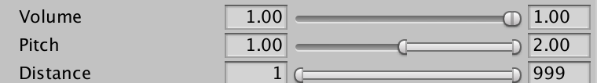

# [Able - Askowl Base Library Enabler](http://unitydoc.marrington.net/Able)

## Executive Summary

Unity provides lots of great functionality, but there are always


* {:toc}

> Read the code in the Examples Folder and run the Example scene

## Introduction

## Maths functions

### Clock.cs - time and date conversions

#### Epoch Time

Epoch time was invented by the early Unix creators to represent time as seconds since the start of 1970 in a 32 bit integer for fast calculations. In this form it wraps around on 2038. It also suffered some inaccuracy because it did not account for leap seconds. This conversion is not 2038 limited as it uses doubles. Leap seconds will only be an issue if you are using dates each side of one - an unlikely event with minor implications.

```c#
DateTime now          = DateTime.Now;
double   epochTimeNow = Clock.EpochTimeNow;
double   epochTime    = Clock.EpochTimeAt(now);
AssertAlmostEqual(epochTime, epochTimeNow);

DateTime later          = now.AddDays(1);
double   epochTimeLater = Clock.EpochTimeAt(later);
AssertAlmostEqual(24 * 60 * 60, epochTimeLater - epochTimeNow);

var diff = later.Subtract(Clock.FromEpochTime(epochTimeLater));
AssertAlmostEqual(diff.TotalSeconds, 0);
```


##### double EpochTimeNow;

Epoch time is always UTC.

##### double EpochTimeAt(DateTime when);

Convert local time to UTC if necessary then translate to epoch time. Unlike Unix Epoch time, leap seconds are accounted for.

##### DateTime FromEpochTime(double epochTime);

Convert back from Epoch UTC time to local time, C# style.

### Compare.cs - equality and almost equality

### AlmostEqual for Floating Point

Comparing floating point numbers can be a hit or miss affair. Every mathematical operation is subject to rounding to fit into the number of bits. A single precision 32 bit float has around 7 digits of accuracy.  Even trivial calculations may not compare equal.

Enter `Compare.AlmostEqual`. You can specify the minimum change or use the defaults of 0.001 for single precision and 0.00001 for doubles.

```c#
IsFalse(Compare.AlmostEqual(a: 1.1f, b: 1.2f, minimumChange: 0.1f));
IsTrue(Compare.AlmostEqual(a: 1.1f,  b: 1.2f, minimumChange: 0.11f));

IsFalse(Compare.AlmostEqual(a: 1.1f, b: 1.11f));
IsTrue(Compare.AlmostEqual(a: 1.1f,  b: 1.0999f));

IsFalse(Compare.AlmostEqual(a: 103.11, b: 104, minimumChange: 0.5));
IsTrue(Compare.AlmostEqual(a: 103.11,  b: 104, minimumChange: 0.9));

IsFalse(Compare.AlmostEqual(a: 123.45678, b: 123.45679));
IsTrue(Compare.AlmostEqual(a: 123.456789, b: 123.45679));
```


### AlmostEqual for Integers

Integers don't suffer from rounding problems. Sometimes it is useful to see if two values are close.

```c#

IsFalse(Compare.AlmostEqual(a: 123L, b: 133L, minimumChange: 10L));
IsTrue(Compare.AlmostEqual(a: 123L,  b: 133L, minimumChange: 11L));

IsFalse(Compare.AlmostEqual(a: 123L, b: 125L));
IsFalse(Compare.AlmostEqual(a: 123L, b: 121L));
IsTrue(Compare.AlmostEqual(a: 123L,  b: 124L));
IsTrue(Compare.AlmostEqual(a: 123L,  b: 122L));

IsFalse(Compare.AlmostEqual(a: 1, b: 4, minimumChange: 2));
IsTrue(Compare.AlmostEqual(a: 1,  b: 3, minimumChange: 4));

IsFalse(Compare.AlmostEqual(a: 1, b: 4));
IsTrue(Compare.AlmostEqual(a: 1,  b: 2));
```


### [ExponentialMovingAverage.cs](https://en.wikipedia.org/wiki/Moving_average#Exponential_moving_average)

***<u>From Wikipedia</u>***:

> An **exponential moving average (EMA)**, also known as an **exponentially weighted moving average (EWMA)**,[[5\]](https://en.wikipedia.org/wiki/Moving_average#cite_note-5) is a first-order [infinite impulse response](https://en.wikipedia.org/wiki/Infinite_impulse_response) filter that applies weighting factors which decrease [exponentially](https://en.wikipedia.org/wiki/Exponential_decay). The weighting for each older [datum](https://en.wikipedia.org/wiki/Data) decreases exponentially, never reaching zero. The graph at right shows an example of the weight decrease.

 ***<u>From Me (Paul Marrington):</u>***

> An **exponential moving average** is a way to calculate an average where older values have less impact on the average than more recent ones.

It is most often used in financial calculations, but I use it mainly for IoT. Many devices can read wildly until the settle down. Then real-world interactions make then inaccurate again. A classis is the compass or magnetometer. Walk past a mass of steel and they will be attracted - just like an engineer. Using an EMA and these variations will be dampened. EMA is also useful when merging IoT data.

#### EMA Initialisation

#### EMA Average Value

#### EMA Average Angle

### Geodetic.cs - distances and bearings

### Tetrad.cs - quaternions with minimal heap use

### Trig.cs - degrees, radians, sides and angles

## Data Structures

### Disposable.cs - helper for IDisposable.Dispose()

### Emitter.cs - the observer pattern

### LinkedList.cs - efficient walking movement

### Pick.cs - Interface to choose from options

### Selector.cs - maintain and pick from a list

### Set.cs - Unity component implementing selector

## Text Manipulation

### Csv.cs - serialization of comma-separated lists

### Json.cs - parse any JSON to dictionary

## Unity Support

### Components.cs - find or create components

### ConditionalHideAttribute.cs

### Log.cs - pluggable logging function

### Object.cs - find game objects

### PlayModeController.cs - control app for live testing

### PlayModeTests.cs - adding asserts to controller

### Range.cs - inspector tool to set high and low bounds

### ValueAttribute.cs - change name of inspector field

### Components

`Components` is a static helper class with functions to create and find Components.

#### Components.Find&lt;T>(name)
Search the current scene for components of type `T`, then return the one with the name supplied. For a call with no name, we use the name of T.

If there are no matching objects in the scene, `Find` tries to load a resource of the supplied type and name. The name can be any path inside a ***Resources*** directory.

####Components.Find&lt;T>(inGameObject)
Find a component by type within a specified GameObject. If not found, do a global Find on the type.

#### Components.Create&lt;T>(gameObject, name)
Calling this creates a component of type T inside the provided game object.  The instance of T has the name supplied or the type name if the former is null.

#### Components.Create&lt;T>(name)
The overload that does not supply a gameObject creates a new one and name the same as the component. The new gameObject attaches to the root of the current hierarchy.

### Selector

It is useful to select one item from a list as needed from a random list of images and sounds to an ordered list of training steps.

```C#
Selector<int> selector = new Selector<int> (new int[] { 0, 1, 2, 3, 4 });

for (int idx = 0; idx < 100; idx++) {
  int at = selector.Pick();
  Use(at);
}
```
#### Selector Initialiser
The magic is in having different pickers for different requirements. The constructor allows for three types. Add more by overriding `Pick()`.

```C#
Selector(T[] choices = null, bool isRandom = true, int exhaustiveBelow = 0);
```

* ***Sequential***: `isRandom` is false or;
* ***Random***: `exhaustiveBelow` is less than the number of choices.
* ***Exhaustive Random***: `exhaustiveBelow` is greater than the number of choices.

To return in a random order, set ***Exhaustive Random***. Nothing repeats until the end.
#### Selector Choices
If the list of items to choose from changes, update the selector with `Choices`. The same picker is reset and used.

```C#
Selector<int> selector = new Selector<int> (new int[] { 0, 1, 2, 3, 4 });
selector.Choices = new int[] { 5, 6, 7, 8 };
```

#### Selector CycleIndex
`CycleIndex` return the index in the `Choices` array of the last item returned. If we were using `Selector` to return the next training item, then we may well need the index to report progress.

### Pick&lt;T>
`Random` is the default picker. In small lists is may appear to be favouring one or another asset.

There is are NUnit Editor tests in ***Examples/Scripts*** that show all the pickers.

### Preview Custom Editor

Unity custom editors provide additional functionality for the Inspector panel. `PreviewEditor&lt;T>` is a generic that adds a ***Preview*** button to the bottom of the Component.

`AudioClipsEditor` is a custom class that plays a sound when pressing ***Preview***.

```C#
  [CustomEditor(typeof(AudioClips))]
  public class AudioClipsEditor : PreviewEditor<AudioSource> {
    protected override void Preview() { ((AudioClips) target).Play(Source); }
  }
```

### Range
`Range` is a `Pick` class with serialised low and high values. Calling `Pick()` returns a random value within but inclusive of the range.

By default, the range can be between 0 and 1. Using `RangeBounds` below allows for different scales.

```C#
    [SerializeField]     private Range volume   = new Range(1.0f, 1.0f);
      source.volume      = volume.Pick();
```
In this example, the potential range is between 0.0 and 1.0 inclusive, but the sliders are both to the right at 1.0.
The initialiser can be empty and the values set by public `Min` and `Max` variables.

A range drawer provides better visual editing of ranges in the Inspector.



Set range values with the sliders or by typing values on the boxes to the left and right.

### RangeBounds Attribute
For more meaningful ranges we add an attribute called `RangeBounds`.

```C#
    [SerializeField, RangeBounds(0, 2)]   private Range pitch    = new Range(1, 2);
    [SerializeField, RangeBounds(0, 999)] private Range distance = new Range(1, 999);
```
The width of the range limit how many digits past the decimal point display.

### Objects Helpers
I am lazy. I hate typing the same scaffolding code. These are functions more often used in testing than production code.

### Find&lt;T>
Use `Find` to search the project for Unity Objects of a defined type with a known name. The search includes disabled items.

```C#
GameObject mainCamera = Objects.Find<GameObject>("Main Camera");
```

Often the object is unique and named after it's underlying class.

```C#
setPickerSample = Objects.Find<SetPickerSample>();
```

`Find` is resource hungry. Only use it in called methods like `Awake`, `Start` or `OnEnable`. It is never necessary for production code but is an excellent helper with play mode tests. 

### Component&lt;T>
`Component` is another tool for play mode testing. Without being part of the game, test code can retrieve a GameObject by unique name/path the then return a reference to a Component of that game object. Because we do not have a game object starting point, the name must be unique. Either a unique name within the scene or an absolute path.

```C#
    results      = Component<Text>("Canvas/Results Panel/Text");
    results.text = "I found you";
```


## PlayMode Test Runner Support
Askowl Custom Assets have tests for Unity editor PlayMode test-runner. Because this is the core Askowl unity package, it includes the rudimentary support for testing. See the Askowl TestAutomator package for more exhaustive support.

### PlayModeController
PlayModeController is a base class for protected methods used to control actions in the game. Most of the methods run in Coroutines so that control code can wait for them to complete. It uses by *PlayModeTests* and *RemoteControl* classes.

#### Scene
The protected reference to the loaded `Scene` object.

#### LoadScene
Load a scene by name from the scenes list in the build.
Sometimes tests have a special scene to highlight actions difficult to reproduce in game-play. Add to the build but they will include little overhead to the release game.

```C#
  [UnityTest] public IEnumerator AccessCustomAssets() {
    yield return LoadScene("Askowl-CustomAssets-Examples");
    //...
  }
```

#### PushButton
At the least a player has to push a button to start the game. You can select the button by the name and path in the hierarchy or a `Button` reference.

```C#
yield return PushButton("Canvas/Show Quote");
// same as
yield return PushButton(Objects.Component<Button>("Show Quote"));
```
The coroutine will return after one tick - giving time for the button watchers to react.

#### Log
Typing `Debug.LogFormat()` gets tiring. For classes that inherit, you can use `Log()` instead.

```C#
Log("Entering Scene {1}", Scene.name);
```

### PlayModeTests
`PlayModeTests` inherits from `PlayModeController` and is the ancestor of concrete tests within Unity.

It overrides functions to add assertions.

* LoadScene(string name) from PlayModeController
* PushButton(string path) from PlayModeController
* Component<T>(string name) from Objects.Component<T>(name)
* FindObject<T>(string name) from Objects.Find<T>(name)
* FindObject<T>() from Objects.Find<T>()

#### PlayModeTests.Component
Use this static method rather than `Objects.Component` when testing to retrieve a typed component from a named `GameObject` in the current scene. It marks a failure if we cannot retrieve a component.

```C#
Text results = Component&lt;Text>("Canvas/Results Panel/Text");
```

#### PlayModeTests.FindObject
Use this static method rather than `Objects.Find` when testing to retrieve a named `GameObject` in the current scene. It marks a failure if we cannot retrieve the component.

```C#
Float currentFloat = FindObject&lt;Float>("SampleFloatVariable");
AudioClips  picker = FindObject<AudioClips>();
```
The latter example will find a GameObject called *AudioClips*.

#### PlayModeTests.PushButton
Given the text name of a game component in the scene, treat it as a button and perform the same action as when a player pushed it on the game screen.

#### CheckPattern
Sometimes we need to look at some UI text. We use regular expressions for that.
```C#
    CheckPattern(@"^Direct Event heard at \d\d/\d\d/\d\d\d\d \d\d:\d\d:\d\d", results.text);
```
### A Sample Play Mode Test
Because we sent the slider with a quote, we need to test a range to make sure all is as it should be.
```C#
[UnityTest]
  public IEnumerator TestIntegerAsset() {
    yield return Setup();

    Slider slider = Component<Slider>("Canvas/Integer Asset/Slider");
    slider.value = 0.77f;
    yield return null;

    int buttonValue = int.Parse(ResultsButtonText);
    Assert.GreaterOrEqual(buttonValue, 76);
    Assert.LessOrEqual(buttonValue, 78);
  }
```