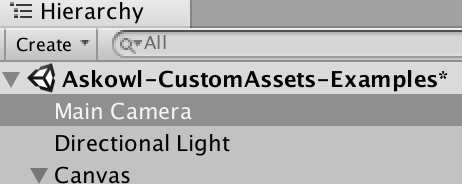

# [Able - Askowl Base Library Enabler](http://unitydoc.marrington.net/Able)

## Executive Summary

Unity provides lots of great functionality, but there are always


* {:toc}

> Read the code in the Examples Folder and run the Example scene

## Introduction

## Maths functions

### Clock.cs - time and date conversions

#### Epoch Time

Epoch time was invented by the early Unix creators to represent time as seconds since the start of 1970 in a 32 bit integer for fast calculations. In this form it wraps around on 2038. It also suffered some inaccuracy because it did not account for leap seconds. This conversion is not 2038 limited as it uses doubles. Leap seconds will only be an issue if you are using dates each side of one - an unlikely event with minor implications.

```c#
DateTime now          = DateTime.Now;
double   epochTimeNow = Clock.EpochTimeNow;
double   epochTime    = Clock.EpochTimeAt(now);
AssertAlmostEqual(epochTime, epochTimeNow);

DateTime later          = now.AddDays(1);
double   epochTimeLater = Clock.EpochTimeAt(later);
AssertAlmostEqual(24 * 60 * 60, epochTimeLater - epochTimeNow);

var diff = later.Subtract(Clock.FromEpochTime(epochTimeLater));
AssertAlmostEqual(diff.TotalSeconds, 0);
```

##### double EpochTimeNow;

Epoch time is always UTC.

##### double EpochTimeAt(DateTime when);

Convert local time to UTC if necessary then translate to epoch time. Unlike Unix Epoch time, leap seconds are accounted for.

##### DateTime FromEpochTime(double epochTime);

Convert back from Epoch UTC time to local time, C# style.

### Compare.cs - equality and almost equality

### AlmostEqual for Floating Point

Comparing floating point numbers can be a hit or miss affair. Every mathematical operation is subject to rounding to fit into the number of bits. A single precision 32 bit float has around 7 digits of accuracy.  Even trivial calculations may not compare equal.

Enter `Compare.AlmostEqual`. You can specify the minimum change or use the defaults of 0.001 for single precision and 0.00001 for doubles.

```c#
IsFalse(Compare.AlmostEqual(a: 1.1f, b: 1.2f, minimumChange: 0.1f));
IsTrue(Compare.AlmostEqual(a: 1.1f,  b: 1.2f, minimumChange: 0.11f));

IsFalse(Compare.AlmostEqual(a: 1.1f, b: 1.11f));
IsTrue(Compare.AlmostEqual(a: 1.1f,  b: 1.0999f));

IsFalse(Compare.AlmostEqual(a: 103.11, b: 104, minimumChange: 0.5));
IsTrue(Compare.AlmostEqual(a: 103.11,  b: 104, minimumChange: 0.9));

IsFalse(Compare.AlmostEqual(a: 123.45678, b: 123.45679));
IsTrue(Compare.AlmostEqual(a: 123.456789, b: 123.45679));
```

### AlmostEqual for Integers

Integers don't suffer from rounding problems. Sometimes it is useful to see if two values are close.

```c#

IsFalse(Compare.AlmostEqual(a: 123L, b: 133L, minimumChange: 10L));
IsTrue(Compare.AlmostEqual(a: 123L,  b: 133L, minimumChange: 11L));

IsFalse(Compare.AlmostEqual(a: 123L, b: 125L));
IsFalse(Compare.AlmostEqual(a: 123L, b: 121L));
IsTrue(Compare.AlmostEqual(a: 123L,  b: 124L));
IsTrue(Compare.AlmostEqual(a: 123L,  b: 122L));

IsFalse(Compare.AlmostEqual(a: 1, b: 4, minimumChange: 2));
IsTrue(Compare.AlmostEqual(a: 1,  b: 3, minimumChange: 4));

IsFalse(Compare.AlmostEqual(a: 1, b: 4));
IsTrue(Compare.AlmostEqual(a: 1,  b: 2));
```

### [ExponentialMovingAverage.cs](https://en.wikipedia.org/wiki/Moving_average#Exponential_moving_average)

***<u>From Wikipedia</u>***:

> An **exponential moving average (EMA)**, also known as an **exponentially weighted moving average (EWMA)**,[[5\]](https://en.wikipedia.org/wiki/Moving_average#cite_note-5) is a first-order [infinite impulse response](https://en.wikipedia.org/wiki/Infinite_impulse_response) filter that applies weighting factors which decrease [exponentially](https://en.wikipedia.org/wiki/Exponential_decay). The weighting for each older [datum](https://en.wikipedia.org/wiki/Data) decreases exponentially, never reaching zero. The graph at right shows an example of the weight decrease.

 ***<u>From Me (Paul Marrington):</u>***

> An **exponential moving average** is a way to calculate an average where older values have less impact on the average than more recent ones.

It is most often used in financial calculations, but I use it mainly for IoT. Many devices can read wildly until the settle down. Then real-world interactions make then inaccurate again. A classis is the compass or magnetometer. Walk past a mass of steel and they will be attracted - just like an engineer. Using an EMA and these variations will be dampened. EMA is also useful when merging IoT data.

#### EMA Initialisation

The simplest form is to create a new EMA object without parameters.

```c#
var ema = new ExponentialMovingAverage(); // lookback defaults to 8
```

As the comment says, the average is over the last 8 values plus the new one. You can set your own.

```c#
var ema = new ExponentialMovingAverage(lookback: 50);
```

The lookback value is application specific. Ask yourself how many data points back is the information irrelevant to the current value. If you take one reading a second and any reading over 15 seconds old has no value, set lookback to 15.

#### EMA Average Value

If you don't make `Average` calls at consistent time intervals the you will need to consider other methods to make the values equally spaced.

```c#
AreEqual(expected: 1f,      actual: ema.Average(value: 1));
AreEqual(expected: 2.6f,    actual: ema.Average(value: 5));
AreEqual(expected: 2.76f,   actual: ema.Average(value: 3));
AreEqual(expected: 4.056f,  actual: ema.Average(value: 6));
AreEqual(expected: 4.0336f, actual: ema.Average(value: 4));
```

#### EMA Average Angle

Using EMA with angles in degrees is exactly the same except that the result is normalised to be between -180 and +180 degrees.

```c#
AreEqual(expected: -10f,       actual: ema.AverageAngle(degrees: -10));
AreEqual(expected: -5.555555f, actual: ema.AverageAngle(degrees: 10));
AreEqual(expected: -5.432098f, actual: ema.AverageAngle(degrees: -5));
AreEqual(expected: -3.113854f, actual: ema.AverageAngle(degrees: 5));
AreEqual(expected: -3.088552f, actual: ema.AverageAngle(degrees: 357));
AreEqual(expected: -1.513316f, actual: ema.AverageAngle(degrees: 364));
```

### Geodetic.cs - distances and bearings

> **Geodesy**: The branch of mathematics dealing with the shape and area of the earth or large portions of it.
>
> **Origin**: late 16th century: from modern Latin geodaesia, from Greek geōdaisia, from gē ‘earth’ + daiein ‘divide’.
>
> https://en.wikipedia.org/wiki/Geodesy
> https://www.movable-type.co.uk/scripts/latlong.html

> **Paul's Definition**: Calculations of distances and bearings of and between two points on the earth's surface and accounting for the curvature of the earth.

#### Coordinates Data Structure

Yet another data structure to contain coordinates. In the end it is more efficient to have separate definitions than it is to burden one definition with lots of irrelevant data. It is particularly poignant when we are dealing with pass-by-value.

In this world-view, coordinates use 64 bit double floating points for accuracy and know whether they are degrees or radians.

```c#
var location = Geodetic.Coords(-27.46850, 151.94379);
var same = Geodetic.Coords(-0.4794157656, 2.65191941345, radians: true);
location.ToRadians();
same.ToDegrees();
Debug.Log(same.ToString()); // -27.46850, 151.94379
```

#### Distance Between Two Points

In geodetic parlance the shortest distance between two points is an arc, not a straight line. This is kind of important if you don't want to tunnel through earth and dive under the sea to get anywhere.

`Kilometres(from, to)` uses the Haversine formula to calculate the distance taking into account an approximation of the earth's curvature. For display convenience there is a version, `DistanceBetween(from, to)`, that returns a string that is more friendly than the raw kilometres. If the distance is below one kilometre, it returns the value as a whole number of metres (i.e. 43 m). For distances below ten kilometres, one decimal place is provided (4.7 km). Above the kilometres are whole numbers only (23 km).

#### Bearing from One Point to the Next

If you were hiking you would take a bearing between yourself and a known landmark and use that bearing to get there.

```c#
var degrees = Geodetic.BearingDegrees(from, to);
var radians = Geodetic.BearingRadians(from, to);
Assert.AreEqual(degrees, Trig.degrees(radians));
```

#### Find One Point from Another

The next navigational trick is to find a destination coordinate when knowing the bearing and distance of that point. Useful if you want to call an air-strike down on an enemy position you are observing.

```c#
Geodetic.Destination(start: here, distanceKm: 1.2, bearingDegrees: 23.4);
```

### Quaternions.cs - adding features

Unity quaternion math focusses on the needs of the game. Great, but there are a few methods needed for augmented reality that are not provided.

#### AroundAxis

Rotate a quaternion around the X, Y or Z axis by the given number of degrees. This is a useful approact for a clock face, a compass or a merry-go-round.

```c#
// ... A
// rotate z axis for magnetic heading
attitude = attitude.AngleAxis(Trig.zAxis, compass.MagneticHeading);
// ... B
```

#### Inverse

An inverse changes the direction of the rotation. If you rotate a quaternion then rotate it again using the inverse then you will get back the original quaternion.

```c#
// C ...
mainCamera.transform.localRotation = attitude.Inverse();
```

#### LengthSquared

The concept of length or magnitude for a quaternion has no visual representation when dealing with attitude or rotation. The catch is that most algorithms require unit quaternions - where the length squared will approach one.

#### Normalise

> We can compute a fast 1/sqrt(x) by using a tangent-line approximation to the function. This is like a really simple 1-step Newton-Raphson iteration, and by tuning it for our specific case, we can achieve high accuracy for cheap. (A Newton-Raphson iteration is how specialized instruction sets like 3DNow and SSE compute fast 1/sqrt).

|           http://www.cs.uky.edu/~cheng/cs633/quaternion.html |
| -----------------------------------------------------------: |
| **The Inner Product, March 2002<br>**Jonathan Blow ([jon@number-none.com](mailto:jon@number-none.com)) |

This version is on an average 20% faster than `normalized` as provided by Unity.

#### RightToLeftHanded

For rotations, quaternions hold information on direction in 3 dimensions and the rotation of the object. Think of an airplane flying straight in a particular direction. Given a point of reference you can calculate the angle on the X, Y and Z planes. Now the airplane dips it's wing and spins upside-down. The calculations before are exactly the same, but the rotation has changed. Just as the euler angles define the direction of travel, the sign of the rotation defines which way the airplane is spinning.

Two of anything with opposite chirality cannot be superimposed on each other and yet can be otherwise identical. The choice of which rotation direction is positive is arbitrary. The gyroscope used in phones has right-hand chirality, while Unity uses left-handed.

```c#
Quaternion rotateTo = Device.Attitude.RightToLeftHanded(Trig.zAxis);
```

#### RotateBy

Unity is left handed using the Z axis for forard. The iOS gyroscope, for example is right handed. We can reverse the Chirality (a fancy word for handed) by negating the offending axis and W. This effectively reverses the direction of rotation.

```c#
var attitude = GPS.Attitude.RightToLeftHanded(Trig.zAxis);
```

#### SwitchAxis

Different IoT devices define different axes as forward. We need to pivot on the third axis by 90 degrees to correct for the difference. This reverses the chirality, but this function corrects for that.

```c#
// B ...
// Gyro Z axis is Unity camera Y.
attitude.SwitchAxis(pivot: Trig.xAxis)
// ... C
```

### Trig.cs

#### Direction

##### Trig.xAxis, Trig.yAxis and Trig.zAxis

When I prefer to use *X, Y, Z* instead of *right, up, forward* I use Trig.Direction values. These are unit directions with either the X, Y or Z component set 1 one to specify the axis.

##### X, Y and Z

Integersw here only one will be non-zero to define axis. Direction is also recorded as it can be 1 or -1.

##### Name

The name is a character constant, being 'X', 'Y' or 'Z'. Use it for switch statements where the character means more than using the ordinal value.

##### Ord

Ordinal value - the same as for `Vector3` - X=0, Y=1, Z=2. The values can be access by ordinal value (i.e. Trig.xAxis[0] == 1).

##### Vector

When Unity provided functions want to describe a direction, they use constants inside `Vector3` such as `Vector3.up`. To provide directions as XYZ, use `Trig.Y.Vector`.

##### VectorName

Just for kicks and giggles you can also retrieve the name of the asociated vector `Trig.Y.VectorName == "up"`.

##### OtherAxes

When we use an axis as a pivot we will really want the other axes to work with. This field refers to an array of the other two Directions. `Trig.xAxis.OtherAxes[0] == Trig.yAxis && Trig.xAxis.OtherAxes[1] == Trig.zAxis`.

##### Negative

`Vector3` has the concept of direction where positive is up and negative is down, with the same for left and right or forward and back. For Trig.Direction, use the unary minus as in `-Trig.xAxis`. OtherAxes for negative directions will themselves be negative. You can check if a direction is negative with `Trig.xAxis.Negative == false`.

Here is a slice of the unit tests for `Trig.xAxis` only.  Use these as a guide for what you can achieve.

```c#
var xAxis = Trig.xAxis;
var yAxis = Trig.yAxis;
var zAxis = Trig.zAxis;

Assert.AreEqual(1,             xAxis.X);
Assert.AreEqual(0,             xAxis.Y);
Assert.AreEqual(0,             xAxis.Z);
Assert.AreEqual(xAxis[0],      xAxis.X);
Assert.AreEqual(xAxis[1],      xAxis.Y);
Assert.AreEqual(xAxis[2],      xAxis.Z);
Assert.AreEqual('X',           xAxis.Name);
Assert.AreEqual("X Axis",      xAxis.ToString());
Assert.AreEqual(0,             xAxis.Ord);
Assert.AreEqual(Vector3.right, xAxis.Vector);
Assert.AreEqual("right",       xAxis.VectorName);
var otherAxes = xAxis.OtherAxes;
Assert.AreEqual(yAxis, otherAxes[0]);
Assert.AreEqual(zAxis, otherAxes[1]);

// Tests for negative
var minusX = -Trig.xAxis;
var minusY = -Trig.yAxis;
var minusZ = -Trig.zAxis;

Assert.IsFalse(xAxis.Negative);
Assert.IsTrue(minusX.Negative);
Assert.AreEqual(-1,           minusX.X);
Assert.AreEqual(0,            minusX.Y);
Assert.AreEqual(0,            minusX.Z);
Assert.AreEqual(minusX[0],    minusX.X);
Assert.AreEqual(minusX[1],    minusX.Y);
Assert.AreEqual(minusX[2],    minusX.Z);
Assert.AreEqual('X',          minusX.Name);
Assert.AreEqual("-X Axis",    minusX.ToString());
Assert.AreEqual(0,            minusX.Ord);
Assert.AreEqual(Vector3.left, minusX.Vector);
Assert.AreEqual("left",       minusX.VectorName);
otherAxes = minusX.OtherAxes;
Assert.AreEqual(minusY, otherAxes[0]);
Assert.AreEqual(minusZ, otherAxes[1]);
```

#### ToRadians

Convert a number in degrees to radians.

```c#
Assert.IsTrue(Compare.AlmostEqual(1.5708, Trig.ToRadians(90)));
```

#### ToDegrees

Convert a value in radians back to degrees. Note the need to reduce accuracy in the comparison due to the calculation.

```c#
Assert.IsTrue(Compare.AlmostEqual(90, Trig.ToDegrees(1.5708), 1e5));
```

#### Relative Position given Distance and Angle or Bearing

Calculate a relative vector in two dimensions give the distance away and the angle or bearing.

##### RelativePositionFromAngle

This is a trigonometric angle where 0 degrees in +X and 90 degrees is East or +1. Increasing angles move the result counter-clockwise

```c#
expected.Set(3.3f, 0);
actual = Trig.RelativePositionFromBearing(3.3f, Trig.ToRadians(90));
AreEqual(expected, actual);
```

##### RelativePositionFromBearing

This is a compass bearing where 0 degrees in North or +Y and 90 degrees is East or +X. Increasing bearings move the result clockwise

```c#
expected.Set(0, 3.3f);
actual = Trig.RelativePositionFromAngle(3.3f, Trig.ToRadians(90));
AreEqual(expected, actual);
```

## Data Structures

### Disposable.cs - helper for IDisposable.Dispose()

With closures and anonymous functions `using(...){...}` can be implemented where it is needed without creating a new class to manage it.

```c#
    [Test]
    public void DisposableExample() {
      Assert.AreEqual(expected: 0, actual: numberOfMonsters);

      using (Ephemeral()) {
        numberOfMonsters += 2;
        Assert.AreEqual(expected: 2, actual: numberOfMonsters);
      }

      Assert.AreEqual(expected: 0, actual: numberOfMonsters);
    }

    private IDisposable Ephemeral() =>
        new Disposable {Action = () => numberOfMonsters = 0};

    private int numberOfMonsters;
  }
```

### Emitter.cs - the observer pattern

*Somebody* owns an ***Emitter*** and many other somebodies can register interest in said emitter. When anyone who has access to the emitter instance pulls the trigger, all observers are told. There is a second version ***Emitter&lt;T>*** that can pass an object between emitter and all observers.

```c#
var emitter = new Emitter();

using (var subscription = emitter.Subscribe(new Observer1())) {
  // we now have one subscription
  Assert.AreEqual(expected: 0, actual: counter);
  // Tell observers we have something for them
  emitter.Fire();
  // The observer changes the value
  Assert.AreEqual(expected: 1, actual: counter);
  // A manual call to Dispose will stop the observer listening ...
  subscription.Dispose();
  // ... and calls OnComplete that in this case sets count to zero
  Assert.AreEqual(expected: 0, actual: counter);
  // Now if we fire...
  emitter.Fire(); // not listening any more
  // ... the counter doesn't change because we have no observers
  Assert.AreEqual(expected: 0, actual: counter);
}
// Outside the using - and Dispose was called implicitly but OnComplete was not called again
Assert.AreEqual(expected: 0, actual: counter);
```

```c#
private struct Observer1 : IObserver {
  public void OnNext()      { ++counter; }
  public void OnCompleted() { counter--; }
}
```

While the generic version can pass additional information.

```c#
var emitter = new Emitter<int>();
using (emitter.Subscribe(new Observer3())) {
  emitter.Fire(10);
}
```

```c#
private struct Observer3 : IObserver<int> {
  public void OnCompleted()            { counter--; }
  public void OnError(Exception error) { throw new Exception(); }
  public void OnNext(int        value) { counter = value; }
}
```

While an ***Emitter*** provides some extra facilities to the built-in ***event*** delegates, it does not improve decoupling. It does pave the way for decoupled events using [***CustomAssets***](/CustomAssets), an extension of ***ScriptableObjects***.

### LinkedList - a different perspective

C#/.Net provides an excellent LinkList implementation. It is, by necessity generic. My implementation has different goals.

1. Reduce garbage collection by keeping unused nodes in a recycling list.
2. Ordered lists by providing a comparator.
3. State management by making it easy to move nodes between lists.
4. Fifo implementation.
5. Walk the list without creating new or temporary object.
6. Debugging support by logging node movements.

#### Nodes

Each item added to a list is wrapped in a node instance. The node is a class, so it resides on the heap. Because nodes are recycled, no garbage collection is required.

##### Node Name

For clarity while debugging a node name includes the home and owner lists as well as whatever the held item gives `ToString()`.

##### Node Owner and Home

When a node is created, the list used is set as the `Home` list. When an item is recycled, it is always returned to it's home recycle bin. Each time a node is moved between lists it's `Owner` is set accordingly.

##### Node Comparison

When walking the list it is sometimes good to see if the node passes or fails a range check. Every node implements <, <=, >, >=, == and !=. The all rely on a single LinkedList function, `Compare` that can be set during initialisation.

##### Move the Node to Another List

Moving nodes provides the core difference between this linked list implementation and others. Moving nodes between lists provides the basic mechanism for a caching state machine. Used in conjunction with ordered lists to feed them to a state in priority order.

##### Update Node Contents

In a statement oriented world we would use `node.Item = value`, but sometimes a more functional approach can be enjoyed `node.MoveTo(state3list).Update(value)`.

##### Dispose of this Node

When you are done with a node, call `Discard()` or wrap in a `using` compound statement. Each node implements the `IDisposable`  interface. Being a green class, the trash is put into a recycling list rather than left hanging for the garbage collector.

```c#
using (var node = taskList.Top) {
    Process(node.Item);
} // node sent to recycling
```


#### Create a New Linked List

Creation defines how the linked list will behave.

##### Unordered Linked Lists and FiFo Stacks

When an item is added to the list it always becomes the `Top` element. `Bottom` will be the oldest entry.

```c#
var numberList = new LinkedList<int>();
Assert.AreEqual(expected: 0, actual: numberList.New());
```

##### Linked-List with Custom Item Create and Reactivation

It is all well and good to return `default(T)`, being zeros or null references, but then the user of your list will need to know to create an item if it is not provided. As an example, consider a list of open long-lived HTTP connections.

```c#
var connections = LinkedList<Connection>{
    CreateItem     = () => new Connection(myURL);
    ReactivateItem = (node) => node.Item.CheckForStaleConnections();
};
// ...
using (var node = connections.Fetch()) {
    response = node.Item.Ask(requestData);
}
```

Yes, I know. This example is ignoring the asynchronous nature of the request and the possibility that the connection has timed out. All in good time.

When a node is sent to recycling it will call `Dispose()` on the item if it is an `IDisposable`. It the item needs reactivation when retrieved for reuse, set an activation parameter as demonstrated above.

##### Ordered Linked Lists

Caching state machines and the like need a list of jobs to process in priority order. Priority could also be a time, a distance or any other measure that we can compare.

```c#
var fences = new LinkedLisk<Geofence> {
    CompareNodes = (left, right) 
        => node.Item.Distance.CompareTo(cursor.Item.Distance)
}
// fences nodes now implement <, <=, >, >=, == and !=
if (fence.Active) fence.MoveTo(fences);	// injects in sorted order
```

#### Node Creation and Movement

##### Add an Item to the Current List

If you have an item that has not been on a list, use `Add` to correct that oversight.

```c#
fences.Add(newFence);
```

It will return a reference to the parent node if you need it for chaining.

##### Recycle a Currently Unused Node

If you require a node where the contents are initialised elsewhere, use `Fetch`. It will pick one from the recycling heap. If the recycling is empty it will create a new item and matching node for you.

```c#
using (node = weatherEvents.Fetch()) {
    node.Item.activate();
}
```

##### Move Item Between Lists

And now we get to the part where real magic happens. Different components can own lists of Jobs. When they have done there bit they can toss the job (node) to the next component that needs it.

```c#
void Update() {
    if (! jobs.Empty) {
        var result = jobs.Top.Item;
        if (result == null) {
            jobs.Top.Discard(); // could have used jobs.Pop()
        } else {
            jobs.Top.MoveTo(dispatcherList);
        }
    }
}
```

In this admittedly theoretical example, once a job has been processed it is either finished or put on another job list for a dispatcher to decide what is next. Note that this example will only work with small numbers of jobs, since it is only processing between 30 and 60 jobs a second. You could use `Walk`, but personally I would use something other than Update - possibly an Emitter so we can process only when needed.

There is also a function to move to the end of a list. It is used with the recycle bin to better disperse usage (LRU - least recently used). It can also be used to move an item to the end of the list regardless of priority.

```c#
var result = jobs.Top.Item;
        if (result == null) {
            jobs.Top.Discard(); // could have used Pop()
        } else if (jobs.IHateThisPerson) {
            jobs.Top.MoveToEnd(jobs);	// will never get processed
        }
```

##### Disposal of a Node

Disposing of a node once it has served it's purpose will call `Dispose()` on the item if it is an `IDiposable`. It will then move the node to the recycle bin in the list it was originally created.

If an item has a known lifetime then by far the best way is with a `using` statement. Like `Try/Finally` it is guaranteed to be called. If the work requires waiting for resources, then put the `using` statement in a Coroutine or it's equivalent.

```c#
IEnumerator MyCoroutine() {
    using (var node = jobList.Fetch()) {
        while (!node.Item.Ready) yield return null;
        Process(node.Item);
    }
} // node will be placed back in recycling after Dispose()
```

Sometimes we do not know the lifetime of an item beforehand. In this case whoever does will need to call `Dispose()` manually.

#### A Lifo Stack

For the uninitiated, ***Lifo*** is an acronym for *Last in first out*. A linked list is well suited for Lifo stacks. The return stack used by most languages with functions is Lifo, so every return returns from the most recently entered function. Stack based languages such as FORTH and FICL make working with Lifo an art form of efficiency (and unreadability). We use Lifo stacks every day with the undo stack when editing or the back button on a browser.

##### Top

`Top` is the standard entry to the linked list, so using Top has no overhead. `Top` will be null if the list is empty. `Top` allows access to the first item for processing before deciding what to move or discard it. Don't expect `Top` to remain when you yield or otherwise relinquish the CPU. If you need it longer, move the item to a list to which your code has exclusive access.

```c#
var working = new LinkedList<MyWorld>();
// ...
var node = readyList.Top.MoveTo(working);
yield return WaitForWorld(node);
node.Dispose();
```


##### Next

`Next` is the second entry below `Top`. It will be null if the list has one entry or is empty. Use it as a premonition of things to come. For ordered list you can tell if there is more immediate work. Can you think of any other uses?

##### Bottom

Bottom is the other less visited end of the stack/linked list. It is used a lot internally, but I can't think where I would use it elsewhere. It will come to me. Great for anyone who likes burning the candle from both ends. There is a `MoveToEnd` method that will make a node the new Bottom.

##### Push

`Push` is another way of moving a node.

```c#
public Node Push(Node node) => node.MoveTo(this);
// ...
dispatchList.Push(job);
```


##### Pop

And, of course, for every push there has to be a pop. But what do we do about node conservation. Easy, put it in the recycle bin. Remember to finish with it or move it somewhere safe before the next implicit or explicit yield. You don't need to dispose of the node since it is already indisposed.

```c#
using (var node = taskList.Top) {
    Process(node.Item);
} // node sent to recycling
// ... is the same as
node = taskList.Pop();
Process(node.Item);
```

In some ways this is better because you are free to move the node without it being moved back to the recycle bin for you.

#### Node Walking

Sing to the melody of *Jive Walking*. Seriously, node walking is the best way of processing all or some of the items in a list. Think of a list of tasks where only tasks that have exceeded their use-by date are to be processed.

```c#
var tasks = new LinkedList<Task> {
    CompareNodes = (left, right) => left.Item.Ready <= right.Item.Ready
}
// ...
tasks.Add(new Task {Ready=Time.RealtimeSinceStartup + 60});	// 1 minute
// ...
void Update() {
    tasks.Walk((node, next) => {
        if (node >= Time.RealtimeSinceStartup) return false;
        using (node) { Process(node.Item); }
        return true;
    });
}
```

The `Walk` action is called for every item in the list from `Top` to `Bottom` or until the action returns false. In this example a task is left idle for one minute before being processed and disposed of. By wrapping it in a `using` statement `Dispose` will be called even if an exception was thrown.

`LinkedList` also implements the `Pick` interface. `Pick` is similar to `Pop` except that it signals the end if an item is not in range. The `Update` above can be implemented differently.

```c#
void Update() {
    
}
```


#### Debug Mode

Because linked lists can be used in a cached state machine, knowing where a task is going can be an important part of understanding functionality.

##### Name

Refers to the name of the list as provided in the constructor. It defaults to the name of the item type followed by an ordinal number.

##### DebugMode

When enabled, `DebugMode` will cause a log entry for every creation or movement of a node. Because this includes stack dumps you can find out who did what where.

##### Dump

`Dump` returns a string with the current contents of a linked list.

@@@@@@@@@@@@@@@@@@@@@@@@@@@@@@@@@@@


### Pick.cs - Interface to choose from options

### Selector.cs - maintain and pick from a list

### Set.cs - Unity component implementing selector

## Text Manipulation

### Csv.cs - serialization of comma-separated lists

### Json.cs - parse any JSON to dictionary

## Unity Support

### Components.cs - find or create components

### ConditionalHideAttribute.cs

### Log.cs - pluggable logging function

### Object.cs - find game objects

### PlayModeController.cs - control app for live testing

### PlayModeTests.cs - adding asserts to controller

### Range.cs - inspector tool to set high and low bounds

### ValueAttribute.cs - change name of inspector field

### Components

`Components` is a static helper class with functions to create and find Components.

#### Components.Find&lt;T>(name)
Search the current scene for components of type `T`, then return the one with the name supplied. For a call with no name, we use the name of T.

If there are no matching objects in the scene, `Find` tries to load a resource of the supplied type and name. The name can be any path inside a ***Resources*** directory.

####Components.Find&lt;T>(inGameObject)
Find a component by type within a specified GameObject. If not found, do a global Find on the type.

#### Components.Create&lt;T>(gameObject, name)
Calling this creates a component of type T inside the provided game object.  The instance of T has the name supplied or the type name if the former is null.

#### Components.Create&lt;T>(name)
The overload that does not supply a gameObject creates a new one and name the same as the component. The new gameObject attaches to the root of the current hierarchy.

### Selector

It is useful to select one item from a list as needed from a random list of images and sounds to an ordered list of training steps.

```C#
Selector<int> selector = new Selector<int> (new int[] { 0, 1, 2, 3, 4 });

for (int idx = 0; idx < 100; idx++) {
  int at = selector.Pick();
  Use(at);
}
```
#### Selector Initialiser
The magic is in having different pickers for different requirements. The constructor allows for three types. Add more by overriding `Pick()`.

```C#
Selector(T[] choices = null, bool isRandom = true, int exhaustiveBelow = 0);
```

* ***Sequential***: `isRandom` is false or;
* ***Random***: `exhaustiveBelow` is less than the number of choices.
* ***Exhaustive Random***: `exhaustiveBelow` is greater than the number of choices.

To return in a random order, set ***Exhaustive Random***. Nothing repeats until the end.
#### Selector Choices
If the list of items to choose from changes, update the selector with `Choices`. The same picker is reset and used.

```C#
Selector<int> selector = new Selector<int> (new int[] { 0, 1, 2, 3, 4 });
selector.Choices = new int[] { 5, 6, 7, 8 };
```

#### Selector CycleIndex
`CycleIndex` return the index in the `Choices` array of the last item returned. If we were using `Selector` to return the next training item, then we may well need the index to report progress.

### Pick&lt;T>
`Random` is the default picker. In small lists is may appear to be favouring one or another asset.

There is are NUnit Editor tests in ***Examples/Scripts*** that show all the pickers.

### Preview Custom Editor

Unity custom editors provide additional functionality for the Inspector panel. `PreviewEditor&lt;T>` is a generic that adds a ***Preview*** button to the bottom of the Component.

`AudioClipsEditor` is a custom class that plays a sound when pressing ***Preview***.

```C#
  [CustomEditor(typeof(AudioClips))]
  public class AudioClipsEditor : PreviewEditor<AudioSource> {
    protected override void Preview() { ((AudioClips) target).Play(Source); }
  }
```

### Range
`Range` is a `Pick` class with serialised low and high values. Calling `Pick()` returns a random value within but inclusive of the range.

By default, the range can be between 0 and 1. Using `RangeBounds` below allows for different scales.

```C#
    [SerializeField]     private Range volume   = new Range(1.0f, 1.0f);
      source.volume      = volume.Pick();
```
In this example, the potential range is between 0.0 and 1.0 inclusive, but the sliders are both to the right at 1.0.
The initialiser can be empty and the values set by public `Min` and `Max` variables.

A range drawer provides better visual editing of ranges in the Inspector.


Set range values with the sliders or by typing values on the boxes to the left and right.

### RangeBounds Attribute
For more meaningful ranges we add an attribute called `RangeBounds`.

```C#
    [SerializeField, RangeBounds(0, 2)]   private Range pitch    = new Range(1, 2);
    [SerializeField, RangeBounds(0, 999)] private Range distance = new Range(1, 999);
```
The width of the range limit how many digits past the decimal point display.

### Objects Helpers
I am lazy. I hate typing the same scaffolding code. These are functions more often used in testing than production code.

### Find&lt;T>
Use `Find` to search the project for Unity Objects of a defined type with a known name. The search includes disabled items.

```C#
GameObject mainCamera = Objects.Find<GameObject>("Main Camera");
```

Often the object is unique and named after it's underlying class.

```C#
setPickerSample = Objects.Find<SetPickerSample>();
```

`Find` is resource hungry. Only use it in called methods like `Awake`, `Start` or `OnEnable`. It is never necessary for production code but is an excellent helper with play mode tests. 

### Component&lt;T>
`Component` is another tool for play mode testing. Without being part of the game, test code can retrieve a GameObject by unique name/path the then return a reference to a Component of that game object. Because we do not have a game object starting point, the name must be unique. Either a unique name within the scene or an absolute path.

```C#
    results      = Component<Text>("Canvas/Results Panel/Text");
    results.text = "I found you";
```



## PlayMode Test Runner Support
Askowl Custom Assets have tests for Unity editor PlayMode test-runner. Because this is the core Askowl unity package, it includes the rudimentary support for testing. See the Askowl TestAutomator package for more exhaustive support.

### PlayModeController
PlayModeController is a base class for protected methods used to control actions in the game. Most of the methods run in Coroutines so that control code can wait for them to complete. It uses by *PlayModeTests* and *RemoteControl* classes.

#### Scene
The protected reference to the loaded `Scene` object.

#### LoadScene
Load a scene by name from the scenes list in the build.
Sometimes tests have a special scene to highlight actions difficult to reproduce in game-play. Add to the build but they will include little overhead to the release game.

```C#
  [UnityTest] public IEnumerator AccessCustomAssets() {
    yield return LoadScene("Askowl-CustomAssets-Examples");
    //...
  }
```

#### PushButton
At the least a player has to push a button to start the game. You can select the button by the name and path in the hierarchy or a `Button` reference.

```C#
yield return PushButton("Canvas/Show Quote");
// same as
yield return PushButton(Objects.Component<Button>("Show Quote"));
```
The coroutine will return after one tick - giving time for the button watchers to react.

#### Log
Typing `Debug.LogFormat()` gets tiring. For classes that inherit, you can use `Log()` instead.

```C#
Log("Entering Scene {1}", Scene.name);
```

### PlayModeTests
`PlayModeTests` inherits from `PlayModeController` and is the ancestor of concrete tests within Unity.

It overrides functions to add assertions.

* LoadScene(string name) from PlayModeController
* PushButton(string path) from PlayModeController
* Component<T>(string name) from Objects.Component<T>(name)
* FindObject<T>(string name) from Objects.Find<T>(name)
* FindObject<T>() from Objects.Find<T>()

#### PlayModeTests.Component
Use this static method rather than `Objects.Component` when testing to retrieve a typed component from a named `GameObject` in the current scene. It marks a failure if we cannot retrieve a component.

```C#
Text results = Component&lt;Text>("Canvas/Results Panel/Text");
```

#### PlayModeTests.FindObject
Use this static method rather than `Objects.Find` when testing to retrieve a named `GameObject` in the current scene. It marks a failure if we cannot retrieve the component.

```C#
Float currentFloat = FindObject&lt;Float>("SampleFloatVariable");
AudioClips  picker = FindObject<AudioClips>();
```
The latter example will find a GameObject called *AudioClips*.

#### PlayModeTests.PushButton
Given the text name of a game component in the scene, treat it as a button and perform the same action as when a player pushed it on the game screen.

#### CheckPattern
Sometimes we need to look at some UI text. We use regular expressions for that.
```C#
    CheckPattern(@"^Direct Event heard at \d\d/\d\d/\d\d\d\d \d\d:\d\d:\d\d", results.text);
```
### A Sample Play Mode Test
Because we sent the slider with a quote, we need to test a range to make sure all is as it should be.
```C#
[UnityTest]
  public IEnumerator TestIntegerAsset() {
    yield return Setup();

    Slider slider = Component<Slider>("Canvas/Integer Asset/Slider");
    slider.value = 0.77f;
    yield return null;

    int buttonValue = int.Parse(ResultsButtonText);
    Assert.GreaterOrEqual(buttonValue, 76);
    Assert.LessOrEqual(buttonValue, 78);
  }
```